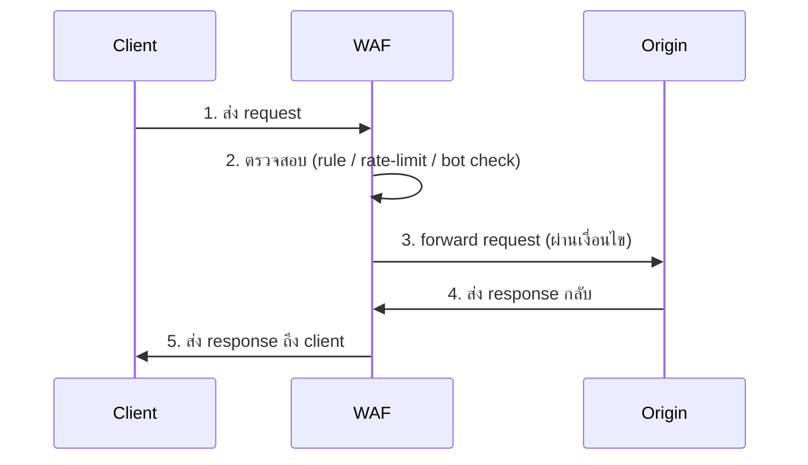

import TrafficFlowAnimation from '@site/src/components/TrafficFlowAnimation';

# Traffic Flow

ภาพรวมทิศทาง 1 request จาก Client ผ่าน WAF ไปถึง Origin แล้วย้อนกลับ

## ดูแบบ Interactive

<TrafficFlowAnimation />
